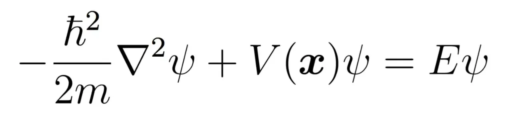
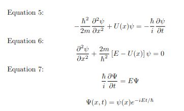

## Wave Equation 
In quantum mechanics, a small particle like elctron, is known to exist both as a particle and as a wave (wave particle duality).
The wave equation describes the movement of energy and is expressed in form of amplitude or energy with respect to location and time In quantum mechanics, the wave equation is known as the Schrödinger equation, which represents the probability of finding the particles in space.

## Schrödinger Wave Equation
The Schrödinger equation is a fundamental equation in quantum mechanics that describes how the quantum state of a physical system changes with time. For a particle of mass  m  in a potential V(x) , the time-independent Schrödinger equation is given by equation 1.By using variable separation,location(x) and time t (t) can be separated out into Time independent SWE (equation 2) and time based equation with exponential solution as shown (equation 3).

</img>
 

Eq 2:  
 

       
 

Eq 3:  
 
 Wave function is finite. If wave function is ψ(x) then at x = −∞ and x = +∞, ψ(x) = 0. 
 ψ(x) must be continuous across all boundaries. No discontinuity can exist
 The derivative ∂ψ(x)/∂x must be continuous also. 
 The wave function must be zero where system potential V(x) is infinity. 

## Key definitions

- **Wave function (ψ):** Describes the behavior of the particle system (or particle wave) and all the system variables defining it. $\psi$ is an expression of
location (x, y, z in 3D) and time (t).
- **Probability density (ψ*ψ):** It is the conjugate product of the wave function, gives the probability of finding the particle
- **Quantization:** The solution of SWE, ψ, for a given bounded system exists only for specific values of Energy and ψ. Thus, the Energy and Wavefunction are
`quantized’. Number representing its quantized state is called the ‘Quantum number’ usually denoted by ’n’.
-**E :** represents the energy of the particle in the system.
-**V(x,y,z)** is the system potential in 3 dimension.

## Free Space

In free space,particle is free to move around in space as particle energy is much higher than system potential.
Consider the simple 1D case, where particle exists freely and system potential is
 V(x) =0
 

 
The solution to this SWE is given by equation 4 which is simplified to equation 5. With system boundary conditions,
we see that the quantized wave solution to this is represented by equation 6 and allowed energy levels by equation7

 

Eq 4:    

Eq 5:    

 
 
Free Space  Example :Electron gun 
<!-- $$ E = \frac{n^2 \pi^2 \hbar^2}{2m a^2} $$ -->

Consider an electron gun that emits electrons with a certain energy, These electrons can be described by a wave function, and their behavior can be analyzed using the Schrödinger equation. In a region with no potential (free space), away from the influence source of Gun & before they get under the potential the anode, the electrons will exhibit wave-like properties.

## Infinite Potential Well

In an infinite potential well, the system potential  V(x)  is zero inside the well (similar to free space), but, infinite at and outside the well walls. This creates boundary conditions : the wave function is zero and outside beyond the walls of the well. The solution in the well is sinusoidal (equation 5) given in standing waves(like flute), and with quantized solution modes (equation 6) and with allowed energy level as shown in equation 7:
where  L  is the width of the well and  n is a positive integer.
 

Eq 6:   

 

Eq 7:   

 

Eq 8:   
 
<!--  -->

## Finite Potential Well
Finite potential well is potential well where the well boundaries are defined by potential greater than particle energy but finite.
Inside the well, we again assume zero potential (like in Infinite potential well) and finite value V(x) at the boundary and beyond.
 The wave function inside the well is similar to that of the infinite well (i.e. free space solution), but outside the well, the wave function decays exponentially (see equatin 8: note exponent is a real number ) . The energy levels are also quantized but differ from those of the infinite well due to the finite potential barriers.
  

Eq 9:  

 
This normalization condition ensures that the particle exists somewhere in space.
